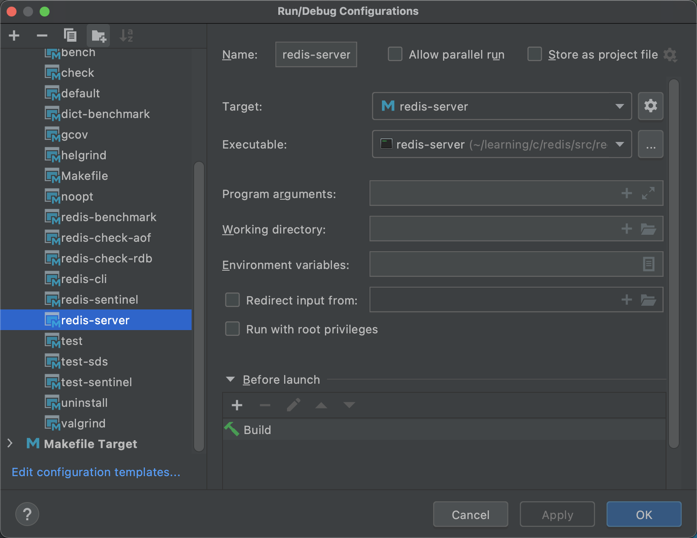

# redis 6.0.0 源码编译调试


# 1.环境配置

操作系统：window 10、Mac

IDE：Clion（ 2021.xx↑）

如果是window环境，还需要配置c语言环境，推荐下载使用 [cygwin](https://cygwin.com/install.html)，配置如下：


# 2.环境搭建

redis源码包使用 make 编译，所以理论上只要 IDE 支持 make 编译都可以轻松搭建好 redis 源码环境。低版本的 Clion 不支持 make，从 2020.2开始，Clion 开始支持 make 编译。

下载好源码后，直接用 Clion 导入，它会自动构建 makefile。构建完以后，直接选择源码目录下的 makefile，点击`Run`生成redis可执行文件，关联这些可执行文件即可：



------

**可能出现的问题**

1. 部分C文件找不到函数。只需要点击进入ae_kqueue.c文件中，添加下面两个头文件:

   ```c
   #include "ae.h"
   #include "zmalloc.h"
   ```

2. 缺少依赖的.h文件。只需要进入src目录下，执行mkreleasehdr.sh脚本即可

   ```shell
   sh mkreleasehdr.sh

# 3.源码整体结构
- deps目录（第三方依赖库）
  - hiredis源码
  - jemalloc源码
  - linenoise源码
  - lua脚本源码
- src目录（功能源码）
  - modules示例源码
  - 各功能模块源码
- tests目录（测试代码与工具）
  - 测试代码子目录
    - unit（单元测试代码）
    - cluster（集群功能测试代码）
    - hyperloglog（hyperloglog误差率计算和展示代码）
    - lru（LRU算法效果展示代码）
  - 测试支撑代码子目录
    - assets
    - helpers
    - modules
    - support
- utils目录（辅助工具）
  - create-cluster（创建集群工具代码）
  - hashtable（rehash过程可视化代码）
  - hyperloglog（hyperloglog误差率计算和展示代码）
  - lru子目录（LRU算法效果展示代码）

# 4.src目录源码全图
数据类型：
- String（t_string.c、sds.c、bitops.c）
- List（t_list.c、ziplist.c）
- Hash（t_hash.c、ziplist.c、dict.c）
- Set（t_set.c、intset.c）
- Sorted Set（t_zset.c、ziplist.c、dict.c）
- HyperLogLog（hyperloglog.c）
- Geo（geo.c、geohash.c、geohash_helper.c）
- Stream（t_stream.c、rax.c、listpack.c）

全局：
- Server（server.c、anet.c）
- Object（object.c）
- 键值对（db.c）
- 事件驱动（ae.c、ae_epoll.c、ae_kqueue.c、ae_evport.c、ae_select.c、networking.c）
- 内存回收（expire.c、lazyfree.c）
- 数据替换（evict.c）
- 后台线程（bio.c）
- 事务（multi.c）
- PubSub（pubsub.c）
- 内存分配（zmalloc.c）
- 双向链表（adlist.c）

高可用&集群：
- 持久化：RDB（rdb.c、redis-check-rdb.c)、AOF（aof.c、redis-check-aof.c）
- 主从复制（replication.c）
- 哨兵（sentinel.c）
- 集群（cluster.c）

辅助功能：
- 延迟统计（latency.c）
- 慢日志（slowlog.c）
- 通知（notify.c）
- 基准性能（redis-benchmark.c）
