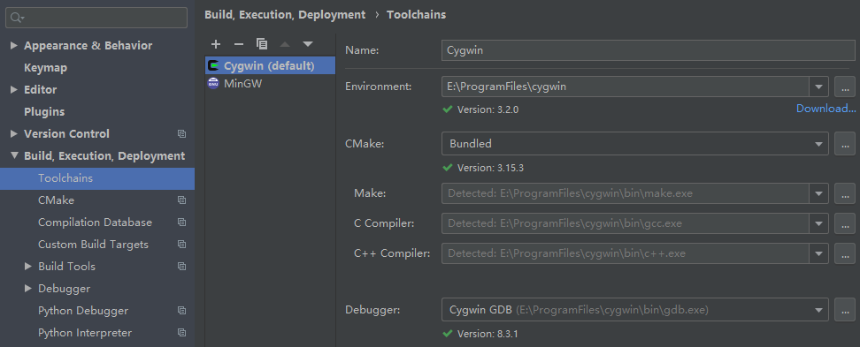

# redis 6.0.0 源码编译调试


# 1.环境配置

操作系统：window 10、Mac

IDE：Clion（ 2021.xx↑）

如果是window环境，还需要配置c语言环境，推荐下载使用 [cygwin](https://cygwin.com/install.html)，配置如下：



# 2.环境搭建

redis源码包使用 make 编译，所以理论上只要 IDE 支持 make 编译都可以轻松搭建好 redis 源码环境。低版本的 Clion 不支持 make，从 2020.2开始，Clion 开始支持 make 编译。

下载好源码后，直接用 Clion 导入，它会自动构建 makefile。构建完以后，直接选择源码目录下的 makefile，点击`Run`生成redis可执行文件，关联这些可执行文件即可：


------

**可能出现的问题**

1. 部分C文件找不到函数。只需要点击进入ae_kqueue.c文件中，添加下面两个头文件:

   ```c
   #include "ae.h"
   #include "zmalloc.h"
   ```

2. 缺少依赖的.h文件。只需要进入src目录下，执行mkreleasehdr.sh脚本即可

   ```shell
   sh mkreleasehdr.sh

